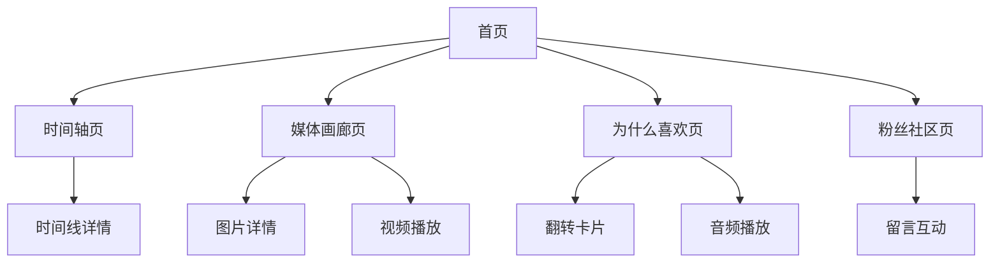

## 1. 产品概述
一个专注于推广和推荐**单一特定偶像**的沉浸式网站，通过交互式故事叙述、媒体画廊和粉丝互动功能，将访客转化为该偶像的忠实粉丝。

目标用户为对该偶像感兴趣或潜在感兴趣的人群，提供深度了解偶像、感受其魅力的沉浸式体验。

## 2. 核心功能

### 2.1 用户角色
| 角色 | 注册方式 | 核心权限 |
|------|----------|----------|
| 访客 | 无需注册 | 浏览所有内容、观看媒体、参与互动体验 |
| 粉丝 | 邮箱注册（仅用于留言） | 在粉丝留言板留言、点赞其他留言 |

### 2.2 功能模块
网站包含以下核心页面：
1. **首页**: 沉浸式欢迎动画、偶像核心魅力展示、快速导航
2. **时间轴页**: 偶像成长历程、重要里程碑、事业发展的交互式时间线
3. **媒体画廊页**: 高清照片集、精选视频片段、音频作品展示
4. **为什么喜欢页**: 交互式卡片翻转、声乐展示、魅力点介绍
5. **粉丝社区页**: 留言板、粉丝分享、互动墙

### 2.3 页面详情
| 页面名称 | 模块名称 | 功能描述 |
|----------|----------|----------|
| 首页 | 沉浸式欢迎区 | 全屏视频背景或动态图片墙，偶像最具代表性的视觉展示，自动播放切换 |
| 首页 | 核心魅力展示 | 突出显示偶像的3-5个最吸引人的特质，带有微动画效果 |
| 首页 | 快速导航 | 视觉化的导航卡片，引导用户探索不同内容区域 |
| 时间轴页 | 交互式时间线 | 垂直滚动时间线，每个节点包含日期、事件描述、相关图片或视频 |
| 时间轴页 | 详情展开 | 点击时间节点展开更多详细信息，包括背景故事和影响 |
| 媒体画廊页 | 照片画廊 | 网格布局展示高清照片，支持点击查看大图和幻灯片模式 |
| 媒体画廊页 | 视频集锦 | 精选视频片段播放列表，支持全屏播放和相关推荐 |
| 媒体画廊页 | 音频作品 | 偶像声乐作品播放器，包含歌曲列表和播放控制 |
| 为什么喜欢页 | 翻转卡片 | 点击卡片翻转显示偶像的不同魅力点，如才华、性格、外貌等 |
| 为什么喜欢页 | 声乐展示 | 音频播放器展示偶像的代表性歌声片段，支持循环播放 |
| 为什么喜欢页 | 统计数据 | 用图表展示偶像的成就数据，如奖项、销量、人气排名等 |
| 粉丝社区页 | 留言板 | 粉丝可以留言分享喜欢偶像的原因，支持文本和表情 |
| 粉丝社区页 | 互动墙 | 展示粉丝的留言、点赞功能、最新留言优先显示 |
| 粉丝社区页 | 加入粉丝团 | 提供加入官方粉丝团的链接或指引 |

## 3. 核心流程
用户浏览流程：
1. 用户进入首页，观看沉浸式欢迎内容，感受偶像魅力
2. 通过时间轴了解偶像的成长历程和重要时刻
3. 在媒体画廊中欣赏偶像的视觉和音频作品
4. 通过"为什么喜欢"页面深入了解偶像的各个方面
5. 在粉丝社区与其他粉丝互动，分享感受

## 4. 用户界面设计

### 4.1 设计风格
- **主色调**: 根据偶像的代表色定制，使用渐变效果增强视觉冲击
- **按钮样式**: 大圆角设计，悬停时有光效或缩放动画
- **字体**: 现代感强的无衬线字体，标题使用粗体突出，正文字体优雅易读
- **布局风格**: 全屏沉浸式体验，大量使用视觉元素，最小化文字干扰
- **图标风格**: 定制化图标，与偶像主题风格保持一致，使用动态效果增强

### 4.2 页面设计概览
| 页面名称 | 模块名称 | UI元素 |
|----------|----------|--------|
| 首页 | 沉浸式欢迎区 | 全屏视频背景，偶像标志性造型，动态标题文字，粒子效果或光效增强 |
| 时间轴页 | 交互式时间线 | 垂直时间轴线，圆形节点设计，悬停时放大显示，平滑滚动过渡 |
| 媒体画廊页 | 照片网格 | 瀑布流布局，图片悬停时轻微放大，边框发光效果，加载动画 |
| 为什么喜欢页 | 翻转卡片 | 3D翻转效果，卡片正面偶像图片，背面详细信息，翻转动效流畅 |
| 粉丝社区页 | 留言卡片 | 卡片式留言展示，用户头像、昵称、留言内容，点赞动画效果 |

### 4.3 响应式设计
采用桌面优先设计，确保在大屏幕上提供最佳的沉浸式体验。同时支持平板和手机自适应，在移动设备上优化触摸交互，确保所有交互元素在小屏幕上仍可操作。

### 4.4 交互动画
- 页面切换使用平滑的淡入淡出或滑动过渡
- 滚动触发的视差效果，增强层次感
- 鼠标悬停时的微妙动画反馈
- 音频播放器具有可视化波形动画
- 翻转卡片使用3D效果，增强交互感
- 留言发送成功后的确认动画