## 1. 架构设计


## 2. 技术描述

- **前端**: React@18 + tailwindcss@3 + vite
- **初始化工具**: vite-init
- **后端**: Supabase (提供认证、数据库、存储)
- **主要依赖**: 
  - @supabase/supabase-js (Supabase客户端)
  - framer-motion (交互动画和页面过渡)
  - lucide-react (图标库)
  - react-intersection-observer (滚动触发动画)
  - react-player (视频播放)

## 3. 路由定义

| 路由 | 用途 |
|-------|---------|
| / | 首页，沉浸式欢迎体验和核心魅力展示 |
| /timeline | 时间轴页，展示偶像成长历程和重要里程碑 |
| /gallery | 媒体画廊页，照片、视频、音频作品展示 |
| /why-stan | 为什么喜欢页，交互式魅力点展示 |
| /community | 粉丝社区页，留言板和互动墙 |
| /login | 登录页面，仅用于粉丝留言功能 |
| /register | 注册页面，新用户注册 |

## 4. 数据模型

### 4.1 数据模型定义

```mermaid
erDiagram
  USERS ||--o{ COMMENTS : writes
  USERS ||--o{ LIKES : gives
  COMMENTS ||--o{ LIKES : receives
  IDOL_INFO ||--o{ TIMELINE_EVENTS : has
  IDOL_INFO ||--o{ MEDIA_ITEMS : contains

  IDOL_INFO {
    uuid id PK
    string name
    string stage_name
    date birth_date
    string group_name
    date debut_date
    string concept_colors
    json basic_info
    string bio
    json achievements
    json stats
  }
  TIMELINE_EVENTS {
    uuid id PK
    uuid idol_id FK
    date event_date
    string title
    string description
    string image_url
    string category
    integer display_order
  }
  MEDIA_ITEMS {
    uuid id PK
    uuid idol_id FK
    string type
    string title
    string url
    string thumbnail_url
    json metadata
    integer display_order
  }
  USERS {
    uuid id PK
    string email UK
    string password_hash
    string nickname
    string avatar_url
    timestamp created_at
  }
  COMMENTS {
    uuid id PK
    uuid user_id FK
    string content
    boolean is_approved
    timestamp created_at
  }
  LIKES {
    uuid id PK
    uuid user_id FK
    uuid comment_id FK
    timestamp created_at
  }
```



### 4.2 数据定义语言

偶像信息表 (idol_info)
```sql
-- 创建偶像信息表
CREATE TABLE idol_info (
    id UUID PRIMARY KEY DEFAULT gen_random_uuid(),
    name VARCHAR(100) NOT NULL,
    stage_name VARCHAR(100),
    birth_date DATE,
    group_name VARCHAR(100),
    debut_date DATE,
    concept_colors VARCHAR(100),
    basic_info JSONB DEFAULT '{}',
    bio TEXT,
    achievements JSONB DEFAULT '[]',
    stats JSONB DEFAULT '{}',
    created_at TIMESTAMP WITH TIME ZONE DEFAULT NOW(),
    updated_at TIMESTAMP WITH TIME ZONE DEFAULT NOW()
);

-- 创建时间轴事件表
CREATE TABLE timeline_events (
    id UUID PRIMARY KEY DEFAULT gen_random_uuid(),
    idol_id UUID REFERENCES idol_info(id) ON DELETE CASCADE,
    event_date DATE NOT NULL,
    title VARCHAR(200) NOT NULL,
    description TEXT,
    image_url TEXT,
    category VARCHAR(50),
    display_order INTEGER DEFAULT 0,
    created_at TIMESTAMP WITH TIME ZONE DEFAULT NOW()
);

-- 创建媒体项目表
CREATE TABLE media_items (
    id UUID PRIMARY KEY DEFAULT gen_random_uuid(),
    idol_id UUID REFERENCES idol_info(id) ON DELETE CASCADE,
    type VARCHAR(20) CHECK (type IN ('photo', 'video', 'audio')),
    title VARCHAR(200) NOT NULL,
    url TEXT NOT NULL,
    thumbnail_url TEXT,
    metadata JSONB DEFAULT '{}',
    display_order INTEGER DEFAULT 0,
    created_at TIMESTAMP WITH TIME ZONE DEFAULT NOW()
);

-- 创建用户表
CREATE TABLE users (
    id UUID PRIMARY KEY DEFAULT gen_random_uuid(),
    email VARCHAR(255) UNIQUE NOT NULL,
    password_hash VARCHAR(255) NOT NULL,
    nickname VARCHAR(100) NOT NULL,
    avatar_url TEXT,
    created_at TIMESTAMP WITH TIME ZONE DEFAULT NOW()
);

-- 创建留言表
CREATE TABLE comments (
    id UUID PRIMARY KEY DEFAULT gen_random_uuid(),
    user_id UUID REFERENCES users(id) ON DELETE CASCADE,
    content TEXT NOT NULL,
    is_approved BOOLEAN DEFAULT true,
    created_at TIMESTAMP WITH TIME ZONE DEFAULT NOW()
);

-- 创建点赞表
CREATE TABLE likes (
    id UUID PRIMARY KEY DEFAULT gen_random_uuid(),
    user_id UUID REFERENCES users(id) ON DELETE CASCADE,
    comment_id UUID REFERENCES comments(id) ON DELETE CASCADE,
    created_at TIMESTAMP WITH TIME ZONE DEFAULT NOW(),
    UNIQUE(user_id, comment_id)
);

-- 创建索引
CREATE INDEX idx_timeline_events_idol_id ON timeline_events(idol_id);
CREATE INDEX idx_timeline_events_date ON timeline_events(event_date DESC);
CREATE INDEX idx_timeline_events_category ON timeline_events(category);
CREATE INDEX idx_media_items_idol_id ON media_items(idol_id);
CREATE INDEX idx_media_items_type ON media_items(type);
CREATE INDEX idx_comments_created_at ON comments(created_at DESC);
CREATE INDEX idx_comments_user_id ON comments(user_id);
CREATE INDEX idx_likes_comment_id ON likes(comment_id);

-- 设置权限
GRANT SELECT ON idol_info TO anon;
GRANT SELECT ON timeline_events TO anon;
GRANT SELECT ON media_items TO anon;
GRANT SELECT ON comments TO anon;
GRANT SELECT ON likes TO anon;

GRANT ALL PRIVILEGES ON idol_info TO authenticated;
GRANT ALL PRIVILEGES ON timeline_events TO authenticated;
GRANT ALL PRIVILEGES ON media_items TO authenticated;
GRANT ALL PRIVILEGES ON comments TO authenticated;
GRANT ALL PRIVILEGES ON likes TO authenticated;
GRANT ALL PRIVILEGES ON users TO authenticated;
```

## 5. 核心功能实现

### 5.1 沉浸式体验
- **全屏视频背景**: 使用HTML5 video元素，支持自动播放和循环
- **滚动视差效果**: 使用react-intersection-observer实现滚动触发的动画
- **3D翻转卡片**: 使用framer-motion实现流畅的3D翻转效果
- **粒子效果**: 使用轻量级粒子库增强视觉效果

### 5.2 媒体展示
- **图片懒加载**: 渐进式图片加载，优化性能
- **视频播放器**: 使用react-player支持多种视频格式
- **音频可视化**: 集成音频波形可视化组件
- **响应式画廊**: 自适应网格布局，支持触摸滑动

### 5.3 交互组件
- **时间轴动画**: 垂直滚动时节点依次出现
- **卡片翻转**: 点击触发3D翻转，展示不同内容
- **留言互动**: 实时显示新留言，支持点赞动画
- **音频播放**: 自定义播放器界面，支持循环和播放列表

## 6. 性能优化

- **图片优化**: 使用WebP格式，多尺寸适配
- **代码分割**: 按路由进行代码分割，减少首屏加载
- **缓存策略**: 静态资源长期缓存，API响应短期缓存
- **CDN加速**: 媒体文件使用CDN分发
- **懒加载**: 图片、视频按需加载，减少初始带宽

## 7. 部署配置

- **静态托管**: 支持Vercel、Netlify等静态托管平台
- **环境变量**: 配置Supabase连接信息和API密钥
- **构建优化**: 启用Gzip压缩，资源最小化
- **SEO优化**: 预渲染关键页面，优化meta标签