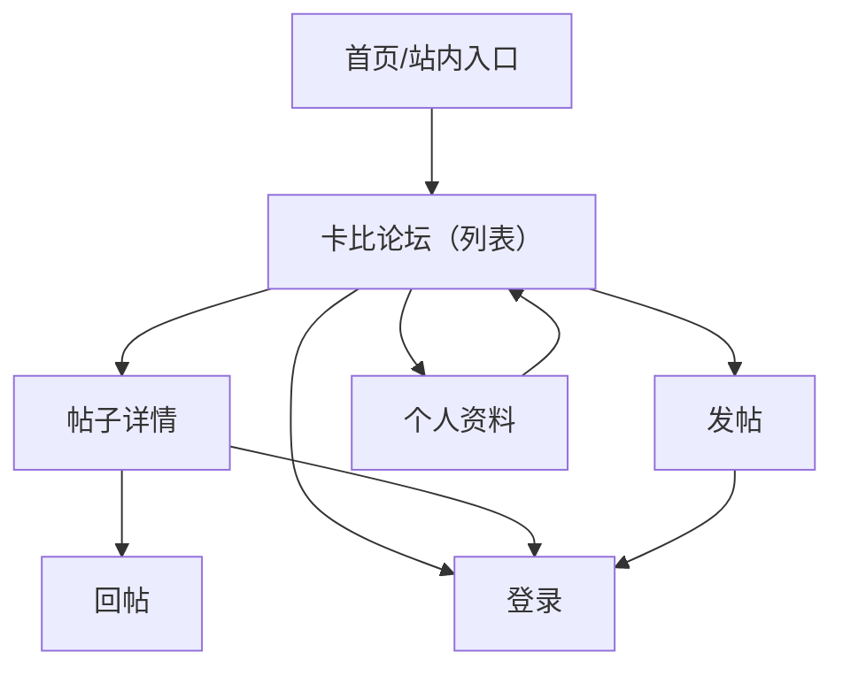

## 1. Product Overview
“卡比论坛”是站内的社区讨论模块，提供发帖、回帖、点赞、标签筛选与个人资料管理。
本次仅做像素风视觉升级与组件抽取，**保持现有功能与数据逻辑不变**。

## 2. Core Features

### 2.1 User Roles
| 角色 | 注册/登录方式 | 核心权限 |
|------|---------------|----------|
| 游客 | 无需登录 | 浏览已通过审核帖子、查看帖子详情、查看回复；可跳转登录页 |
| 已登录用户 | Supabase Auth 登录/注册 | 发帖（含图片与标签）、回帖、点赞/取消点赞、举报帖子、编辑昵称与头像、删除自己的帖子 |
| 管理员 | 登录后通过角色/RPC 判断 | 在帖子与回复中显示 ADMIN 标识（管理后台不在本次范围） |

### 2.2 Feature Module
本模块需求包含以下页面（路由）与核心模块：
1. **卡比论坛页（/community）**：帖子列表/筛选、发帖、帖子详情与回帖、个人资料与我的帖子。
2. **登录页（/login）**：未登录交互的跳转入口（功能不改，仅确保视觉兼容）。

#### 视觉规范（像素风）
- 目标：在不改变交互流程的前提下，让论坛从“柔和圆角”升级为“像素机/掌机”氛围。
- 设计关键词：8px 网格、硬边框、硬阴影、有限调色板、像素纹理背景。
- 组件形态：圆角从 2xl/3xl 收敛为 **0–8px**，统一 **2–3px 实线描边**，阴影为 **offset shadow（不使用大范围模糊）**。

#### 需要改动的页面范围（仅视觉与可维护性）
- 必改：/community（包含内部视图：列表、发帖、详情、个人资料）。
- 轻量联动：/login（仅按钮/输入框等通用组件的像素风兼容，不改表单行为）。
- 不在范围：数据库/表结构、RLS、Supabase Storage bucket、审核与管理后台功能、路由结构调整。

#### 可复用组件清单（建议抽取，不新增功能）
- 布局容器：PixelWindow（带标题栏/边框/阴影的主容器）、PixelSection（分区标题+内容）、PixelCard。
- 表单：PixelInput、PixelTextarea、PixelSelect/Segment（用于分类选择）、PixelFilePicker（图片选择）。
- 反馈：PixelEmptyState、PixelLoadingState、PixelToast（替换 alert 的视觉承载，可先保留 alert 行为）。
- 交互：PixelButton（primary/secondary/danger）、PixelIconButton、PixelChip（标签）、PixelBadge（ADMIN/状态）。
- 业务块：PostListItem、PostMetaRow（作者/日期/分类/点赞/回复数）、ImagePreviewStrip、ReplyItem、ReportPanel。

### 2.3 Page Details
| Page Name | Module Name | Feature description |
|---|---|---|
| 卡比论坛页（/community） | 帖子列表 | 展示已通过审核帖子；置顶优先、时间倒序；支持标签筛选状态展示与清除 |
| 卡比论坛页（/community） | 点赞 | 对帖子执行点赞/取消点赞；未登录提示并引导去登录 |
| 卡比论坛页（/community） | 发帖 | 创建帖子（标题、内容、分类、标签、图片上传到存储并回填 URL）；提交后回到列表 |
| 卡比论坛页（/community） | 帖子详情 | 展示帖子正文、图片、标签、点赞数；支持举报（填写原因并提交） |
| 卡比论坛页（/community） | 回帖 | 已登录用户提交回复；列表按时间正序展示；未登录引导登录 |
| 卡比论坛页（/community） | 个人资料 | 展示邮箱/昵称/头像；上传头像并更新；编辑昵称；展示“我的帖子”与删除自己的帖子 |
| 登录页（/login） | 登录入口 | 提供进入论坛发帖/点赞/回帖所需的认证能力（功能与流程不变） |

## 3. Core Process
- 游客流：进入论坛 → 浏览列表/筛选标签 → 查看帖子详情与回复 → 需要互动（点赞/回帖/发帖/举报）时跳转登录。
- 已登录用户流：进入论坛 →（可）发帖/点赞 → 查看详情 → 回帖 →（可）进入个人资料编辑昵称/头像、管理自己的帖子。

