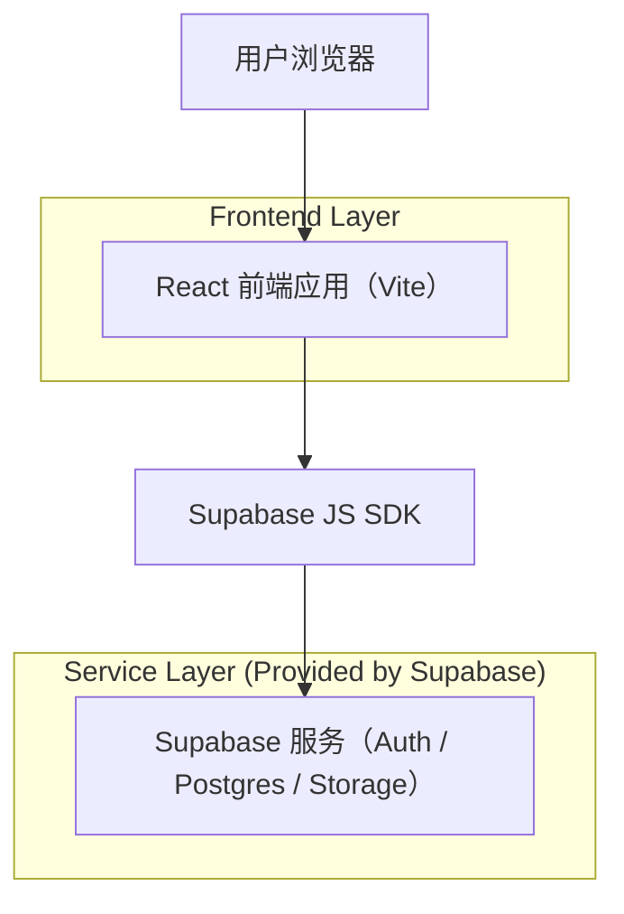

## 1.Architecture design

## 2.Technology Description
- Frontend: React@18 + react-router-dom + tailwindcss@3 + framer-motion + lucide-react
- Backend: None（直接由前端通过 Supabase SDK 访问）
- BaaS: Supabase（Auth、PostgreSQL、Storage、RPC）

## 3.Route definitions
| Route | Purpose |
|---|---|
| /community | 卡比论坛：列表/发帖/详情/个人资料（同一路由内用视图状态切换） |
| /login | 登录（论坛互动需要） |
| /register | 注册 |

## 4.Implementation Plan（保持功能不变）
### 4.1 像素风样式落地策略
- 作用域：优先在 `/community` 页面根节点增加 `kirby-pixel` 样式作用域，避免影响其他页面。
- 设计令牌：用 CSS 变量定义像素风 palette、边框、阴影、圆角（0–8px）、间距（8px grid）。
- Tailwind 集成：
  - 方案 A（推荐）：在 `index.css` 的 `@layer components` 增加 `.kirby-pixel .pixel-*` 组件类，Community 内用这些类组合。
  - 方案 B：仅使用 Tailwind 原子类，但统一封装到可复用组件里，避免 Community.tsx 继续膨胀。
- 图像/图标：保留 lucide-react（不改交互），通过统一的 IconButton/Badge 包装控制 stroke、背景与像素阴影；如后续替换像素图标，只影响展示层。

### 4.2 组件抽取与文件组织（建议）
- `src/components/pixel/`：PixelButton、PixelInput、PixelWindow、PixelChip、PixelBadge、PixelEmptyState…（纯展示）。
- `src/components/forum/`：PostListItem、PostDetailHeader、ReplyItem、ReportPanel、ImagePreviewStrip…（展示+少量 props）。
- 业务逻辑（Supabase 查询、状态机 view/list/detail/create/profile）保持在 `src/pages/Community.tsx` 或拆到 hooks（不改变行为与请求）。

### 4.3 不改动约束（显式保证）
- 不调整 Supabase 表结构、RLS、bucket、RPC；不改变现有查询字段与排序逻辑。
- 不改变路由与权限边界：未登录仍只能浏览并被引导登录。
- 仅允许“视觉表现/组件复用/代码可读性”层面的改造。
